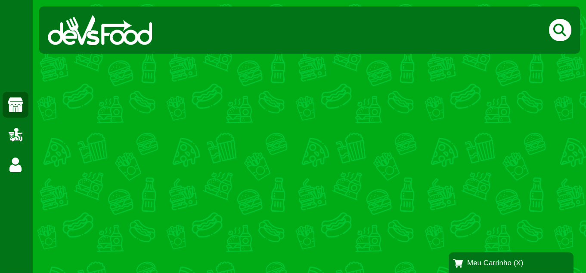

### Projeto DevsFood usando a tecnologia <b>REACJS</b> (Parte FrontEnd)
- Projeto responsável por fazer os pedidos online e permite que os usuários possam fazer o acompanhamento do mesmo.

- Dentro do <b>README</b> da pasta do projeto está tudo que foi ou está sendo usando.
https://github.com/thiagoadssilva/devsFood/blob/main/frontend/README.md

## Parte do <b>Menu Lateral</b> 

## Parte da tela de <b>Busca dos Produtos</b>

## Tela  <b>Principal</b> (até o momento!)

