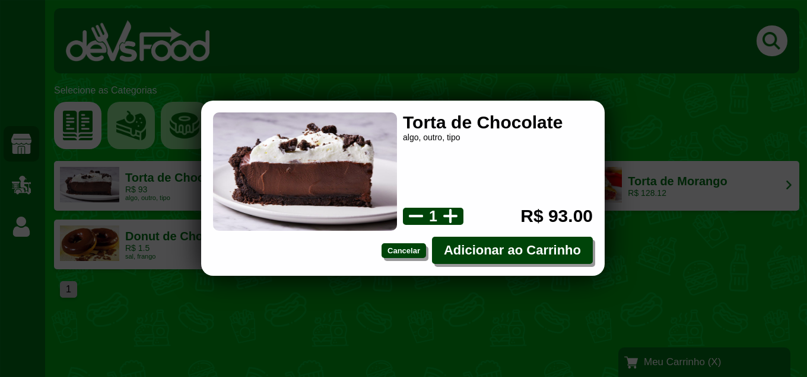

### Projeto DevsFood usando a tecnologia <b>REACJS</b> (Parte FrontEnd)
- Projeto responsável por fazer os pedidos online e permite que os usuários possam fazer o acompanhamento do mesmo.

- Dentro do <b>README</b> da pasta do projeto está tudo que foi ou está sendo usando.
https://github.com/thiagoadssilva/devsFood/blob/main/frontend/README.md

## <b>Menu Lateral</b> 

## <b>Busca dos Produtos</b>

## <b>Principal</b>

## <b>Exibição dos Itens</b> 

## <b>Paginação</b>

## <b>Modal</b>

## <b>Carrinho de Compras</b>

